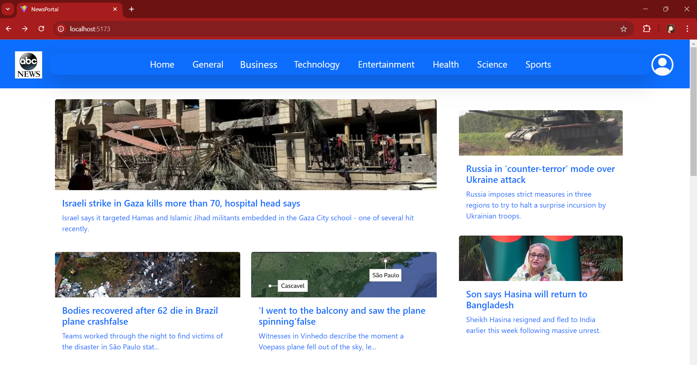

# React + Vite

NewsPortal is a web application designed to fetch and display news articles from various sources using the News API. It provides a simple interface for users to stay updated with the latest news across different categories.

## Screenshot of the homepage with news articles displayed.

## Screenshot of the footer

## Screenshot of the login page

## Screenshot of the signup page

## Screenshot of the dashboard page after the authentication

